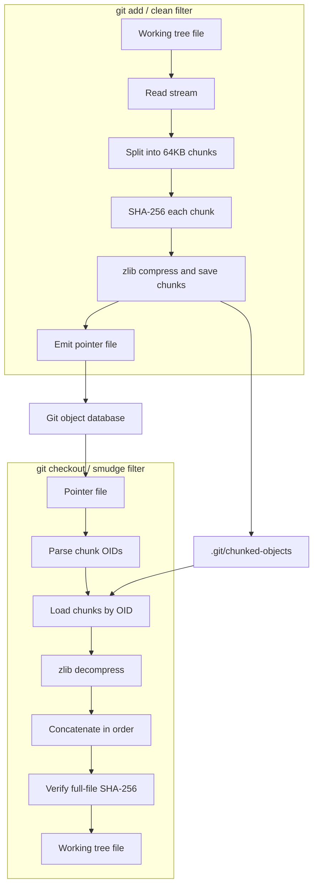

<p align="center">
  
</p>

<h1 align="center">Git Chunked Store</h1>

<p align="center">
  一个基于 Git clean/smudge filter 的内容寻址分片存储后端。
</p>

<p align="center">
  <a href="README_en.md">English</a> ·
  <a href="#快速开始">快速开始</a> ·
  <a href="docs/demo.md">Demo</a> ·
  <a href="#命令参考">命令参考</a> ·
  <a href="#架构">架构</a>
</p>

<p align="center">
  
  
  
</p>

## 概览

Git Chunked Store 是一个实验性的 Git 大文件存储工具。它通过 Git 的 clean/smudge filter 接入 `git add` 和 `git checkout` 流程，把被 `.gitattributes` 标记的大文件切成固定大小的分片，并将分片以 SHA-256 内容寻址的方式压缩存储在本地 `.git/chunked-objects` 中。

它和 Git LFS 的思路相似：Git 仓库里只保存一个轻量 pointer 文件，真实内容由外部存储管理。不同点是 Git Chunked Store 不是按整文件存储，而是按 64KB chunk 存储，因此跨文件、跨版本的重复 chunk 可以天然去重。

当前版本专注于本地 chunk store。`.git/chunked-objects` 不会随普通 `git push` 上传到远端仓库；多人协作场景需要配套的 chunk 同步机制。

## 特性

- **分片级去重**：文件被切成 64KB chunk，相同 chunk 只存一份。
- **内容寻址**：每个 chunk 使用原始内容的 SHA-256 作为 OID。
- **压缩存储**：chunk 写入前使用 zlib 压缩。
- **流式 clean**：大文件不需要完整载入内存，按 chunk 读取和处理。
- **并发写入**：streaming clean 使用 worker pool 并发压缩和保存 chunk。
- **原子落盘**：chunk 先写临时文件，再 rename 到最终路径。
- **完整性校验**：smudge 和 fsck 会验证文件级 hash 与 chunk hash。
- **垃圾回收**：`gc` 可清理不再被 Git 历史引用的孤立 chunk。
- **指标统计**：`stats` 显示压缩率、引用 chunk、孤立 chunk 和缺失 chunk。
- **零第三方运行时依赖**：核心实现只使用 Go 标准库。

## 快速开始

### 1. 构建

```bash
git clone <repo-url>
cd git-chunked-store
go build -o git-chunked-store .
```

可选：把二进制放到 `PATH` 中。

```bash
sudo mv git-chunked-store /usr/local/bin/
```

### 2. 在目标仓库中启用

进入你想管理大文件的 Git 仓库：

```bash
cd /path/to/your/repo
git-chunked-store setup
```

`setup` 会写入 `filter.chunked.clean` 和 `filter.chunked.smudge` 配置，创建默认 `.gitattributes`，并安装 `.git/hooks/pre-auto-gc` 以便 `git gc --auto` 触发 chunk GC。

### 3. 正常使用 Git

```bash
cp large-video.mp4 .
git add large-video.mp4
git commit -m "add large video"
```

`git add` 会触发 clean filter：真实文件被切分并存入 `.git/chunked-objects`，Git 对象库中只保存 pointer 文件。

checkout 时 smudge filter 会读取 pointer，按顺序加载 chunk，解压并还原原始文件。

## 命令参考

| 命令 | 用途 |
|---|---|
| `git-chunked-store setup` | 配置 Git filter、默认 `.gitattributes` 和 GC hook |
| `git-chunked-store clean` | clean filter 入口，通常由 Git 自动调用 |
| `git-chunked-store smudge` | smudge filter 入口，通常由 Git 自动调用 |
| `git-chunked-store gc` | 删除不再被 Git 历史引用的 chunk |
| `git-chunked-store gc --dry-run` | 预览将被删除的孤立 chunk |
| `git-chunked-store fsck` | 校验 pointer、chunk 和重建文件的完整性 |
| `git-chunked-store stats` | 输出 chunk store 的压缩、引用和孤立数据指标 |

### `stats`

```bash
git-chunked-store stats
```

示例输出：

```text
Stored chunks: 128
Referenced chunks: 120
Orphaned chunks: 8
Missing referenced chunks: 0
Logical chunk size: 8.0 MB (8388608 bytes)
Compressed size: 4.2 MB (4404019 bytes)
Orphaned compressed size: 256.0 KB (262144 bytes)
Compression ratio: 52.5%
```

`Missing referenced chunks` 大于 0 通常表示 pointer 引用的 chunk 在本地存储中缺失，应运行 `fsck` 获取更详细的错误信息。

### `fsck`

```bash
git-chunked-store fsck
```

`fsck` 会扫描所有可达 Git 提交中的 pointer 文件，并验证：

- pointer 文件格式是否合法
- pointer 引用的 chunk 是否存在
- chunk 解压后 SHA-256 是否等于 chunk OID
- 重建后的文件大小是否等于 pointer `size`
- 重建后的文件 SHA-256 是否等于 pointer `oid`

### `gc`

```bash
git-chunked-store gc --dry-run
git-chunked-store gc
```

`gc` 会扫描 Git 历史中仍被 pointer 引用的 chunk，并删除本地 chunk store 中不再被引用的文件。内部使用 `git cat-file --batch` 批量读取 blob，避免为每个 blob 启动独立 Git 进程。

## 架构

### Clean / Smudge 流程



### Pointer 文件格式

```text
version https://git-lfs-chunked/1
oid sha256:<full-file-sha256>
size <file-size>
chunk-size 65536
chunks <chunk-count>
chunk-oids sha256:<chunk-1> sha256:<chunk-2> ...
```

空文件会生成 `chunks 0`，并省略 `chunk-oids` 行。

### Chunk 存储布局

```text
.git/chunked-objects/
├── ab/
│   └── cdef...    # zlib-compressed chunk
└── f0/
    └── 1234...
```

路径格式：

```text
.git/chunked-objects/<sha256-first-2>/<sha256-remaining-62>
```

这种布局和 Git loose object 类似，可以避免单目录文件数量过大。

## 项目结构

```text
.
├── cmd/
│   ├── clean.go              # clean filter and streaming chunk writes
│   ├── smudge.go             # smudge filter and file reconstruction
│   ├── setup.go              # Git filter / attributes / hook setup
│   ├── gc.go                 # unreferenced chunk collection
│   ├── fsck.go               # integrity verification
│   ├── stats.go              # chunk store metrics
│   └── integration_test.go
├── internal/
│   ├── chunker/              # chunk splitting and hashing
│   ├── pointer/              # pointer serialization and parsing
│   └── store/                # compressed content-addressed chunk store
├── .github/workflows/        # CI and release workflows
├── docs/assets/logo.svg
├── main.go
└── go.mod
```

## 开发

```bash
go test ./... -count=1
go vet ./...
```

CI 会在 Linux、macOS 和 Windows 上运行测试与 `go vet`。

发布流程由 GitHub Actions 触发：

```bash
git tag v0.1.0
git push origin v0.1.0
```

release workflow 会构建：

- `linux-amd64`
- `linux-arm64`
- `darwin-amd64`
- `darwin-arm64`
- `windows-amd64.exe`

## 限制

- chunk store 当前仅保存在本地 `.git/chunked-objects` 中。
- 普通 `git push` 不会上传 chunk 数据。
- 仓库迁移或多人协作需要额外同步 `.git/chunked-objects`，或实现远端 chunk 存储。
- 当前使用固定 64KB 分片；在文件头部插入内容时，后续分片边界可能整体漂移。

## 安全性与可靠性

- OID 必须是 64 位小写 hex SHA-256，防止路径穿越。
- chunk 写入使用临时文件和原子 rename。
- 并发写入同一 chunk 时，内容寻址使结果幂等。
- smudge 会校验重建文件的全文 SHA-256。
- fsck 可离线检查 chunk store 是否损坏或缺失 chunk。
- stats 可暴露孤立 chunk 和缺失引用，便于维护。

## 路线图

- [ ] 支持远端 chunk push/fetch
- [ ] 支持 pack 文件，减少大量小文件带来的文件系统压力
- [ ] 支持 content-defined chunking，降低头部插入导致的 chunk 边界漂移
- [ ] 为 `stats` 增加 JSON 输出，方便脚本集成

## License

MIT
