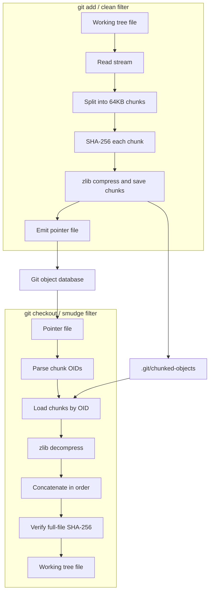

<p align="center">
  
</p>

<h1 align="center">Git Chunked Store</h1>

<p align="center">
  A content-addressed chunk storage backend built on Git clean/smudge filters.
</p>

<p align="center">
  <a href="README.md">中文</a> ·
  <a href="#quick-start">Quick Start</a> ·
  <a href="#commands">Commands</a> ·
  <a href="#architecture">Architecture</a>
</p>

<p align="center">
  
  
  
</p>

## Overview

Git Chunked Store is an experimental large-file storage tool for Git. It hooks into `git add` and `git checkout` through Git clean/smudge filters, splits files selected by `.gitattributes` into fixed-size chunks, and stores those chunks in a local `.git/chunked-objects` directory using SHA-256 content addressing.

It follows the same broad idea as Git LFS: Git stores a lightweight pointer file while the actual payload is managed outside the normal Git object database. The difference is that Git Chunked Store stores content at 64KB chunk granularity, so repeated chunks across files and versions are naturally deduplicated.

The current version focuses on a local chunk store. `.git/chunked-objects` is not uploaded by a normal `git push`; multi-user workflows require an additional chunk synchronization mechanism.

## Features

- **Chunk-level deduplication**: files are split into 64KB chunks; identical chunks are stored once.
- **Content addressing**: each chunk is named by the SHA-256 hash of its raw content.
- **Compressed storage**: chunks are zlib-compressed before being written to disk.
- **Streaming clean filter**: large files are processed incrementally instead of being fully loaded into memory.
- **Concurrent chunk writes**: streaming clean uses a worker pool for chunk compression and storage.
- **Atomic persistence**: chunks are written to temporary files and then renamed into place.
- **Integrity verification**: smudge and fsck verify file-level and chunk-level hashes.
- **Garbage collection**: `gc` removes chunks no longer referenced by Git history.
- **Metrics**: `stats` reports compression ratio, referenced chunks, orphaned chunks, and missing chunks.
- **No runtime dependencies**: the core implementation uses only the Go standard library.

## Quick Start

### 1. Build

```bash
git clone <repo-url>
cd git-chunked-store
go build -o git-chunked-store .
```

Optionally move the binary into your `PATH`:

```bash
sudo mv git-chunked-store /usr/local/bin/
```

### 2. Enable it in a repository

In the Git repository where you want chunked storage:

```bash
cd /path/to/your/repo
git-chunked-store setup
```

`setup` configures `filter.chunked.clean` and `filter.chunked.smudge`, creates a default `.gitattributes`, and installs `.git/hooks/pre-auto-gc` so `git gc --auto` can trigger chunk GC.

### 3. Use Git normally

```bash
cp large-video.mp4 .
git add large-video.mp4
git commit -m "add large video"
```

`git add` triggers the clean filter. The original file is chunked and stored under `.git/chunked-objects`, while Git stores only a pointer file.

During checkout, the smudge filter reads the pointer, loads chunks in order, decompresses them, and reconstructs the original file.

## Commands

| Command | Purpose |
|---|---|
| `git-chunked-store setup` | Configure Git filters, default `.gitattributes`, and the GC hook |
| `git-chunked-store clean` | Clean filter entrypoint, normally invoked by Git |
| `git-chunked-store smudge` | Smudge filter entrypoint, normally invoked by Git |
| `git-chunked-store gc` | Delete chunks no longer referenced by Git history |
| `git-chunked-store gc --dry-run` | Preview orphaned chunks without deleting them |
| `git-chunked-store fsck` | Verify pointer files and chunk store integrity |
| `git-chunked-store stats` | Report compression, reference, and orphan metrics |

### `stats`

```bash
git-chunked-store stats
```

Example output:

```text
Stored chunks: 128
Referenced chunks: 120
Orphaned chunks: 8
Missing referenced chunks: 0
Logical chunk size: 8.0 MB (8388608 bytes)
Compressed size: 4.2 MB (4404019 bytes)
Orphaned compressed size: 256.0 KB (262144 bytes)
Compression ratio: 52.5%
```

If `Missing referenced chunks` is greater than 0, one or more pointer files reference chunks that are absent from the local store. Run `fsck` for detailed integrity errors.

### `fsck`

```bash
git-chunked-store fsck
```

`fsck` scans pointer files in all reachable Git commits and verifies:

- pointer files are parseable
- referenced chunks exist
- decompressed chunk SHA-256 matches the chunk OID
- reconstructed file size matches pointer `size`
- reconstructed file SHA-256 matches pointer `oid`

### `gc`

```bash
git-chunked-store gc --dry-run
git-chunked-store gc
```

`gc` scans Git history for chunk references and removes locally stored chunks that are no longer referenced. Internally it uses `git cat-file --batch` to avoid starting a separate Git process for each blob.

## Architecture

### Clean / Smudge Flow



### Pointer Format

```text
version https://git-lfs-chunked/1
oid sha256:<full-file-sha256>
size <file-size>
chunk-size 65536
chunks <chunk-count>
chunk-oids sha256:<chunk-1> sha256:<chunk-2> ...
```

Empty files use `chunks 0` and omit the `chunk-oids` line.

### Chunk Layout

```text
.git/chunked-objects/
├── ab/
│   └── cdef...    # zlib-compressed chunk
└── f0/
    └── 1234...
```

Path format:

```text
.git/chunked-objects/<sha256-first-2>/<sha256-remaining-62>
```

This mirrors Git loose objects and avoids putting too many files in a single directory.

## Project Structure

```text
.
├── cmd/
│   ├── clean.go              # clean filter and streaming chunk writes
│   ├── smudge.go             # smudge filter and file reconstruction
│   ├── setup.go              # Git filter / attributes / hook setup
│   ├── gc.go                 # unreferenced chunk collection
│   ├── fsck.go               # integrity verification
│   ├── stats.go              # chunk store metrics
│   └── integration_test.go
├── internal/
│   ├── chunker/              # chunk splitting and hashing
│   ├── pointer/              # pointer serialization and parsing
│   └── store/                # compressed content-addressed chunk store
├── .github/workflows/        # CI and release workflows
├── docs/assets/logo.svg
├── main.go
└── go.mod
```

## Development

```bash
go test ./... -count=1
go vet ./...
```

CI runs tests and `go vet` on Linux, macOS, and Windows.

Releases are created from tags:

```bash
git tag v0.1.0
git push origin v0.1.0
```

The release workflow builds:

- `linux-amd64`
- `linux-arm64`
- `darwin-amd64`
- `darwin-arm64`
- `windows-amd64.exe`

## Limitations

- The chunk store is currently local to `.git/chunked-objects`.
- A normal `git push` does not upload chunk data.
- Repository migration or multi-user collaboration requires synchronizing `.git/chunked-objects` separately, or adding a remote chunk store.
- The current chunker uses fixed 64KB boundaries; inserting bytes near the beginning of a file can shift later chunk boundaries.

## Safety and Reliability

- OIDs must be 64-character lowercase hex SHA-256 values, preventing path traversal.
- Chunk writes use temporary files and atomic rename.
- Concurrent writes to the same chunk are idempotent because storage is content-addressed.
- Smudge verifies the reconstructed file SHA-256.
- Fsck can check for corrupted or missing chunks offline.
- Stats exposes orphaned chunks and missing references for maintenance.

## Roadmap

- [ ] Remote chunk push/fetch
- [ ] Pack files to reduce filesystem overhead from many small chunks
- [ ] Content-defined chunking to reduce boundary shifts after inserts
- [ ] JSON output for `stats`

## License

MIT
